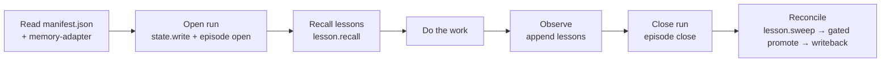
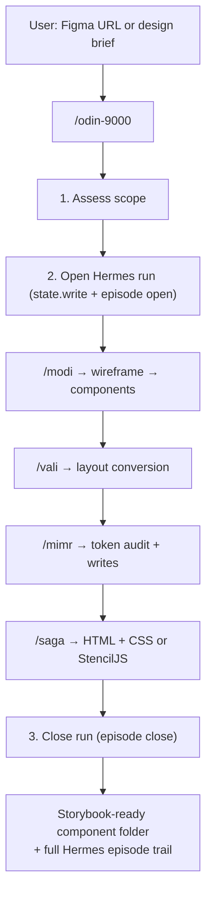
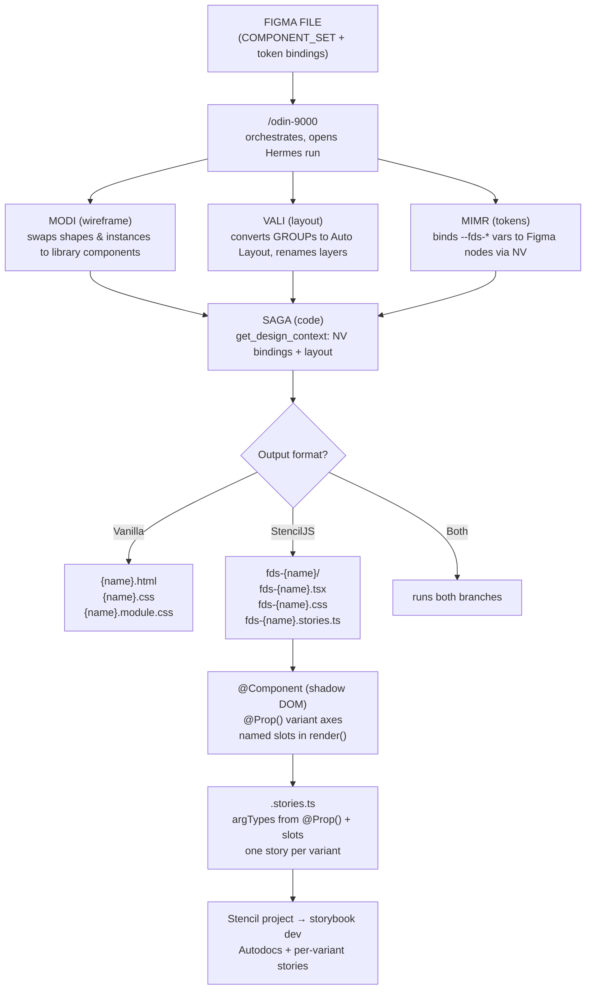
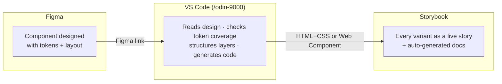
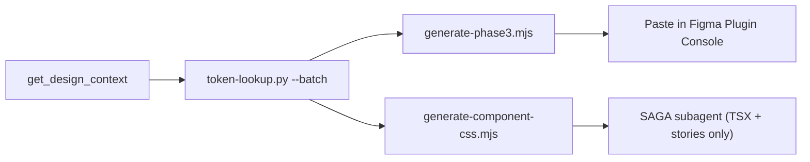

# Odin Flow


A GitHub Copilot agent skill suite for automating the Figma → Design System → Storybook pipeline. Powered by the **Hermes harness** for persistent run state, an episode journal, and agent lessons — all stored locally in the repo, no external service required.

---

## Documentation

| Guide                                            | For                                                                                                                                                       |
| ------------------------------------------------ | --------------------------------------------------------------------------------------------------------------------------------------------------------- |
| [docs/use/USAGE.md](docs/use/USAGE.md)           | **Operating ODIN Flow** — prerequisites, quickstart, the skills, worked examples, controls, troubleshooting.                                              |
| [docs/tech/INTERNALS.md](docs/tech/INTERNALS.md) | **Internals** — architecture, the manifest contract, ODIN's loop, the Hermes harness, model routing, the scripts API, data formats, and how to extend it. |

The sections below are a quick tour; the guides above go deeper.

---

## Skills

### ODIN-9000 — Orchestrator for Design Intent & Navigation

```text
 ██████╗ ██████╗ ██╗███╗   ██╗
██╔═══██╗██╔══██╗██║████╗  ██║
██║   ██║██║  ██║██║██╔██╗ ██║
██║   ██║██║  ██║██║██║╚██╗██║
╚██████╔╝██████╔╝██║██║ ╚████║
 ╚═════╝ ╚═════╝ ╚═╝╚═╝  ╚═══╝
```

The top-level orchestrator. Reads design intent from a Figma URL or brief, decides which sub-skills to run, and sequences them in dependency order. Dispatches each sub-skill as an isolated subagent, resolves the model per task, and records every decision in the Hermes episode journal for future sessions.

**Invoke:** `/odin-9000`
**Pipeline:** MODI → VALI → MIMR → SAGA · VOLUNDR (parallel doc branch)
**Model:** Claude Opus 4.8 (orchestrator)

---

### MODI — Model-to-Object Design Instantiator

```text
███╗   ███╗ ██████╗ ██████╗ ██╗
████╗ ████║██╔═══██╗██╔══██╗██║
██╔████╔██║██║   ██║██║  ██║██║
██║╚██╔╝██║██║   ██║██║  ██║██║
██║ ╚═╝ ██║╚██████╔╝██████╔╝██║
╚═╝     ╚═╝ ╚═════╝ ╚═════╝ ╚═╝
```

Wireframe parsing and instance swapping engine. Resolves placeholder shapes (rectangles, ellipses) to real FDS library components and swaps existing instances to newer versions with full variant axis mapping. Uses a hybrid resolution strategy: cached component map → design system search → interactive user prompt.

**Invoke:** `/modi`
**Inputs:** Figma frame URL + mode selection (parse / swap / scan-library)
**Outputs:** Swapped component instances in Figma, updated component map
**Use when:** A wireframe has placeholder shapes, or existing instances need to be migrated to a different component version

---

### MIMR — Metadata Inventory & Mapping Repository

```text
███╗   ███╗██╗███╗   ███╗██████╗
████╗ ████║██║████╗ ████║██╔══██╗
██╔████╔██║██║██╔████╔██║██████╔╝
██║╚██╔╝██║██║██║╚██╔╝██║██╔══██╗
██║ ╚═╝ ██║██║██║ ╚═╝ ██║██║  ██║
╚═╝     ╚═╝╚═╝╚═╝     ╚═╝╚═╝  ╚═╝
```

Hybrid two-pass token audit engine. Combines Figma REST API + Token Studio shared plugin data with Plugin API native variable resolution to produce a merged conflict report and perform bulk token writes via mapping rules.

**Invoke:** `/mimr`
**Inputs:** Figma frame URL + Personal Access Token
**Outputs:** Token audit report, conflict detection, bulk write log
**Use when:** Tokens have changed, bindings are missing, or a bulk migration is needed

---

### VALI — Visual Alignment & Layout Instantiator

```text
██╗   ██╗ █████╗ ██╗     ██╗
██║   ██║██╔══██╗██║     ██║
██║   ██║███████║██║     ██║
╚██╗ ██╔╝██╔══██║██║     ██║
 ╚████╔╝ ██║  ██║███████╗██║
  ╚═══╝  ╚═╝  ╚═╝╚══════╝╚═╝
```

Layout formatting engine. Converts Figma GROUPs and unwired FRAMEs into semantic auto-layout frames named using the `{direction / role}` convention (`section`, `group`, `pattern`). Prepares structure for MIMR token handoff.

**Invoke:** `/vali`
**Inputs:** Figma frame URL
**Outputs:** Converted + renamed auto-layout frames in Figma
**Use when:** Layers are unstructured groups or absolute-position frames before tokenizing

---

### SAGA — Storybook Automation & Generative Asset

```text
███████╗ █████╗  ██████╗  █████╗
██╔════╝██╔══██╗██╔════╝ ██╔══██╗
███████╗███████║██║  ███╗███████║
╚════██║██╔══██║██║   ██║██╔══██║
███████║██║  ██║╚██████╔╝██║  ██║
╚══════╝╚═╝  ╚═╝ ╚═════╝ ╚═╝  ╚═╝
```

Code generation engine. Scaffolds semantic HTML + vanilla CSS + CSS Modules, **or** a StencilJS Web Component folder (`fds-{name}.tsx` + `fds-{name}.css` + `fds-{name}.stories.ts`) from a Figma Auto Layout node. Derives `--fds-*` CSS custom properties directly from native variable (NV) bindings — no hardcoded values. StencilJS output includes shadow DOM, typed `@Prop()` per variant axis, named slots, and a Storybook 9/10 CSF3 story file ready to drop into a Stencil project.

**Invoke:** `/saga`
**Inputs:** Figma frame URL
**Outputs (vanilla):** `{name}.html`, `{name}.css`, `{name}.module.css`
**Outputs (StencilJS):** `fds-{name}/fds-{name}.tsx`, `fds-{name}.css`, `fds-{name}.stories.ts`
**Use when:** A component is ready (post-VALI + post-MIMR) and code output or Storybook handoff is needed

---

### VOLUNDR — Documentation Generator

```text
██╗   ██╗ ██████╗ ██╗     ██╗   ██╗███╗   ██╗██████╗ ██████╗
██║   ██║██╔═══██╗██║     ██║   ██║████╗  ██║██╔══██╗██╔══██╗
██║   ██║██║   ██║██║     ██║   ██║██╔██╗ ██║██║  ██║██████╔╝
╚██╗ ██╔╝██║   ██║██║     ██║   ██║██║╚██╗██║██║  ██║██╔══██╗
 ╚████╔╝ ╚██████╔╝███████╗╚██████╔╝██║ ╚████║██████╔╝██║  ██║
  ╚═══╝   ╚═════╝ ╚══════╝ ╚═════╝ ╚═╝  ╚═══╝╚═════╝ ╚═╝  ╚═╝
```

FDS component documentation generator. Analyzes a Figma component set, extracts control props and variant structure, and writes documentation frames directly on the component's page — following the FDS template (Component Header, Control Props table, Variants, optional Building Blocks).

**Invoke:** `/volundr`
**Inputs:** Figma component URL or node id
**Outputs:** Documentation frames on the component's Figma page (same page, below the component)
**Use when:** A component needs FDS-style documentation generated or updated in Figma. Can be invoked directly or dispatched by ODIN when a documentation request is detected.

---

### Librarian — KB & Token Registry

```text
██╗     ██╗██████╗ ██████╗  █████╗ ██████╗ ██╗ █████╗ ███╗   ██╗
██║     ██║██╔══██╗██╔══██╗██╔══██╗██╔══██╗██║██╔══██╗████╗  ██║
██║     ██║██████╔╝██████╔╝███████║██████╔╝██║███████║██╔██╗ ██║
██║     ██║██╔══██╗██╔══██╗██╔══██║██╔══██╗██║██╔══██║██║╚██╗██║
███████╗██║██████╔╝██║  ██║██║  ██║██║  ██║██║██║  ██║██║ ╚████║
╚══════╝╚═╝╚═════╝ ╚═╝  ╚═╝╚═╝  ╚═╝╚═╝  ╚═╝╚═╝╚═╝  ╚═╝╚═╝  ╚═══╝
```

A read-only subagent that owns the large external Token Studio JSON and Knowledge Base `.md` repos behind a narrow query interface. When a token value is missing from the local `token-registry.md`, or a KB lookup is needed, ODIN (or MIMR) dispatches Librarian instead of loading the multi-megabyte source files into context.

Librarian keeps a **local mirror** of the external repos under `.github/prompts/.hermes/cache/`, refreshed by `sync-kb.sh` with a cheap staleness check (`git ls-remote` SHA probe — only re-pulls when the remote branch SHA differs).

| Source     | Repo                                 | Branch                         | Path                                              |
| ---------- | ------------------------------------ | ------------------------------ | ------------------------------------------------- |
| Token JSON | `<org>/core-design-system-variables` | `main`                         | `data`                                            |
| KB docs    | `<org>/kb-docs`                      | `feat/fds-token-docs-refactor` | `knowledge/shared/global/design-standards/tokens` |

**Invoke:** dispatched automatically (not user-invocable)
**Model:** Claude Haiku 4.5
**Refresh mirror:** `bash .github/prompts/.hermes/sync-kb.sh` (add `--force` to re-pull regardless of SHA)

---

### Kevin — Response Style Modifier 🌶️

```text
██╗  ██╗███████╗██╗   ██╗██╗███╗   ██╗
██║ ██╔╝██╔════╝██║   ██║██║████╗  ██║
█████╔╝ █████╗  ██║   ██║██║██╔██╗ ██║
██╔═██╗ ██╔══╝  ╚██╗ ██╔╝██║██║╚██╗██║
██║  ██╗███████╗ ╚████╔╝ ██║██║ ╚████║
╚═╝  ╚═╝╚══════╝  ╚═══╝  ╚═╝╚═╝  ╚═══╝
```

A persona overlay, not a workflow — it modifies how the agent narrates, never what it does. Kevin is **always on by default**: every ODIN and skill response is narrated in-persona. Three verbosity modes:

| Mode       | Style                                                                                        |
| ---------- | -------------------------------------------------------------------------------------------- |
| **Lite**   | Short sentences. Casual, like lunch. One analogy max. Why big talk when small talk do trick. |
| **Normal** | Drop articles, fragments OK, short synonyms. Tables encouraged. One-liners when possible.    |
| **Ultra**  | Abbreviate everything. Arrows for flow. One word when one word enough.                       |

**Controls:**

```
/kevin off                 # disable the persona for the rest of the session
/kevin on                  # re-enable after /kevin off
/kevin lite|normal|ultra   # switch mode at any time
```

On the first skill invocation per session, Kevin asks once which mode to use (default: Normal), then caches it. Technical data (node IDs, variant props, counts) stays 100% accurate in every mode. Hermes housekeeping (`state.write`, `episode.append`, `lesson.append`) and git operations always run in Ultra — nobody needs a story about an episode append.

---

## Memory — Hermes harness

This project uses the **Hermes harness** for persistent memory instead of an external issue tracker. Everything lives locally in the repo under `.github/prompts/.hermes/`, reached through a single seam — `memory-adapter.md` — so the rest of the system never hard-codes where memory lives.

| File / dir           | Role                                                                     |
| -------------------- | ------------------------------------------------------------------------ |
| `memory-adapter.md`  | The only place that knows where memory lives (the seam)                  |
| `episodes.jsonl`     | The `open → close` audit trail — every Figma write gets a paired episode |
| `lessons.jsonl`      | Durable agent lessons — read at startup, appended during Observe         |
| `state/<runId>.json` | Live, volatile run state (gitignored)                                    |
| `cache/`             | Librarian's local mirror of external token/KB repos (gitignored)         |
| `sync-kb.sh`         | Refreshes the Librarian mirror with a staleness check                    |

**Run lifecycle (per skill invocation):**



- **Open** a run → `state.write` + `episode.append({phase:"open", skill, summary})`.
- **Recall** lessons → `lesson.recall([skill])` before doing work; honour what returns.
- **Close** a run → `episode.append({phase:"close", skill, summary})`, **then reconcile**.

### Self-improvement loop

Recalling and appending lessons is only the first half. On **every** run close (and on demand via
`/odin lessons`), ODIN runs a **reconciliation** sweep that promotes pending lessons into the rule
files that actually drive behaviour:

1. `lesson.sweep()` collects lessons with `applied:false` and a non-null `ruleProposal`, grouped
   by target file with near-duplicates collapsed.
2. If any are pending, ODIN surfaces a single **gated** `vscode_askQuestions` prompt (multi-select,
   opt-in) listing each proposal as `skill · file · one-line lesson`.
3. Approved proposals are written into their data file (`mimr/data/mapping-rules.md`,
   `vali/data/layout-rules.md`, `modi/data/component-map.md`), then `lesson.update` flips that
   line to `applied:true` + stamps `appliedAt`. Declined proposals resurface next sweep.

Rule files are **never** auto-edited without explicit approval. An empty sweep finishes silently.

| Control         | Effect                                                                              |
| --------------- | ----------------------------------------------------------------------------------- |
| `/odin lessons` | Run the reconciliation sweep standalone (opens its own `open → close` episode pair) |
| `/odin refine`  | Alias of `/odin lessons`                                                            |

Read `.github/prompts/manifest.json` first on every invocation — it is the tiny skill→files map and the local analog of a Hermes skill-bundle.

---

## Model routing & escalation safety

ODIN resolves a model for each subagent dispatch. Two layers compose:

1. **Per-agent default** — each `.github/agents/*.agent.md` declares a durable `model:` in frontmatter (mirrored in `manifest.json`).
2. **Per-task escalation** — ODIN may pass a higher (or lower) model to `runSubagent` for a specific step. This never rewrites the default.

| Skill                    | Default model     | Escalates to (per task)                                         |
| ------------------------ | ----------------- | --------------------------------------------------------------- |
| ODIN-9000 (orchestrator) | Claude Opus 4.8   | —                                                               |
| Librarian                | Claude Haiku 4.5  | —                                                               |
| MODI                     | Claude Haiku 4.5  | Sonnet 4.6 (ambiguous variant mapping / non-trivial resolution) |
| VALI                     | Claude Sonnet 4.6 | —                                                               |
| MIMR                     | Claude Sonnet 4.6 | Opus 4.8 (large/ambiguous conflict audit)                       |
| SAGA                     | Claude Sonnet 4.6 | Opus 4.8 (complex multi-state component)                        |

**Escalation safety gate (mandatory):** before dispatching any subagent on a model **higher** than its frontmatter default, ODIN MUST ask the user via a confirmation prompt and receive explicit approval — no silent escalation. If declined, ODIN dispatches on the default instead (the step is never blocked). Downgrades (e.g. Sonnet → Haiku for a trivial step) are exempt and need no confirmation. The chosen model and approval are recorded as `episode.escalation = { from, to, approved }`.

Models are passed to `runSubagent` as `"<Model Name> (copilot)"`.

---

## Setup

### Prerequisites

| Tool                                                | Purpose                               | Required |
| --------------------------------------------------- | ------------------------------------- | -------- |
| VS Code 1.96+                                       | Editor                                | ✅       |
| GitHub Copilot (Individual / Business / Enterprise) | Agent runtime                         | ✅       |
| Figma MCP extension                                 | Figma API bridge                      | ✅       |
| Node.js + npm                                       | Tooling                               | ✅       |
| Python 3.10+                                        | Librarian token-lookup script         | ✅       |
| `git` with access to the design-system source repos | Librarian mirror sync (private repos) | Optional |

> The Hermes harness needs **no installation** — it is file-based and lives in `.github/prompts/.hermes/` inside this repo.

---

### 1. Install Figma MCP in VS Code

> **Can this be automated?**
> The Figma MCP extension must be installed manually through the VS Code marketplace (extensions cannot be auto-installed by a repo).

**Steps:**

1. Open VS Code → Extensions (`Cmd+Shift+X`)
2. Search for **"Figma for VS Code"** (publisher: Figma)
3. Click **Install**
4. After install, open the Command Palette (`Cmd+Shift+P`) → **"Figma: Sign In"**
5. Authenticate with your Figma account

Alternatively via CLI:

```bash
code --install-extension figma.figma-vscode-extension
```

> The Figma MCP server starts automatically when you open a Copilot Chat session after signing in.

---

### 2. Get a Figma Personal Access Token (PAT)

MIMR uses the Figma REST API directly (for `sharedPluginData` access), which requires a PAT separate from the MCP login.

**Steps:**

1. Go to [figma.com](https://figma.com) → click your avatar (top-right) → **Settings**
2. Scroll to **Security** → **Personal access tokens**
3. Click **Generate new token**
4. Give it a name (e.g. `odinflow-agent`) and set expiry
5. Copy the token — it starts with `figd_`

> **Keep your PAT private.** Never commit it. When MIMR asks for `{pat}`, paste it directly in chat — it is never logged or stored by the skill.

---

### 3. (Optional) Prime the Librarian mirror

Librarian queries a **local clone** of the external Token Studio JSON and KB repos rather than loading the large source files into context. To populate or refresh that mirror:

```bash
bash .github/prompts/.hermes/sync-kb.sh          # refresh only if remote SHA changed
bash .github/prompts/.hermes/sync-kb.sh --force  # re-pull regardless of SHA
```

The script does a sparse checkout of just the token/KB directories into `.github/prompts/.hermes/cache/` (gitignored) and records the synced SHAs in `cache/kb-manifest.json`. Re-running is idempotent — it prints `✓ up to date` when nothing changed.

> The design-system source repos are **private** — the sync needs authenticated git access (SSH key or `gh auth login`). Without access, Librarian falls back to the local `token-registry.md`.

---

### 4. Clone and run

```bash
git clone git@github.com:karlmalotabs/odin-9000-flow.git
cd odin-9000-flow

# (optional) prime the Librarian mirror
bash .github/prompts/.hermes/sync-kb.sh
```

Then open VS Code and type `/odin-9000` in Copilot Chat.

---

## Skill pipeline



Each sub-skill runs as an isolated subagent. ODIN forwards handoff contracts so downstream skills avoid redundant Figma reads:

| Handoff     | Contract                                                                           |
| ----------- | ---------------------------------------------------------------------------------- |
| VALI → MIMR | node list `[{id,type}]` forwarded as `PRIOR_SCAN` (skips MIMR tree walk)           |
| MIMR → SAGA | NV map `{prop: shortName, value}` reused for `--fds-*` CSS vars (no re-resolution) |
| MODI → VALI | swap report; converted instances ready for the layout pass                         |

### Technical pipeline (SAGA detail)



---

## Project structure

```
odin-9000-flow/
├── .github/
│   ├── copilot-instructions.md        # Global Copilot + Hermes rules
│   └── prompts/
│       ├── manifest.json              # Skill→files map + model routing (read FIRST)
│       ├── .hermes/                   # Hermes harness (memory & run state)
│       │   ├── memory-adapter.md      # The memory seam
│       │   ├── episodes.jsonl         # open → close audit trail
│       │   ├── lessons.jsonl          # durable agent lessons
│       │   ├── state/                 # live run state (gitignored)
│       │   ├── cache/                 # Librarian mirror (gitignored)
│       │   └── sync-kb.sh             # mirror refresh + staleness check
│       ├── odin-9000.prompt.md        # /odin-9000 entry point
│       ├── modi.prompt.md             # /modi entry point
│       ├── mimr.prompt.md             # /mimr entry point
│       ├── vali.prompt.md             # /vali entry point
│       ├── saga.prompt.md             # /saga entry point
│       ├── kevin.prompt.md            # /kevin persona overlay
│       ├── odin-9000/
│       │   └── odin-9000.prompt.md
│       ├── modi/
│       │   ├── modi.prompt.md
│       │   ├── data/                  # component-map.md
│       │   └── scripts/               # scan-wireframe.figma.js, swap.figma.js
│       ├── mimr/
│       │   ├── mimr.prompt.md
│       │   ├── data/                  # token-registry, mapping-rules, token-index
│       │   └── scripts/               # audit*.figma.js, bulk-update.figma.js, generate-phase3.mjs, token-lookup.py
│       ├── vali/
│       │   ├── vali.prompt.md
│       │   ├── data/                  # layout-rules.md
│       │   └── scripts/               # scan.figma.js, process.figma.js
│       └── saga/
│           ├── saga.prompt.md
│           └── scripts/               # generate-component-css.mjs
├── .github/agents/                    # Subagent definitions (model + tools per agent)
│   ├── librarian.agent.md
│   ├── modi.agent.md
│   ├── vali.agent.md
│   ├── mimr.agent.md
│   └── saga.agent.md
├── AGENTS.md                          # Agent workflow reference
└── CLAUDE.md                          # Claude Code integration
```

---

## Designer → Engineer handoff

SAGA is the bridge between design and engineering. Once MIMR has bound tokens and VALI has structured the layers, a designer can run `/saga` on any Figma component and produce a folder that drops directly into an existing Stencil project.



### What gets generated

```
src/components/fds-notification-banner/
  fds-notification-banner.tsx        ← Stencil Web Component (shadow DOM)
  fds-notification-banner.css        ← scoped styles, --fds-* vars only
  fds-notification-banner.stories.ts ← Storybook 9/10 CSF3 story
```

The story uses `@storybook/web-components` + `lit` html renderer and includes:

- `argTypes` auto-populated from Figma variant axes (`@Prop() type`, `@Prop() context`…)
- Named slot args exposed as Storybook controls
- `tags: ['autodocs']` for the auto-generated docs page
- One named story per primary variant (Success, Error, Alert…)

Storybook picks up the story automatically if the project's `stories` glob covers `src/components/**/*.stories.ts` — no manual import needed.

### What the engineer does NOT need to derive manually

| Normally manual                           | With SAGA output                                               |
| ----------------------------------------- | -------------------------------------------------------------- |
| Translate Figma padding/gap → CSS         | Already `var(--fds-container-card)`, `var(--fds-gap-v-group)`  |
| Determine variant prop names              | `@Prop() type`, `@Prop() context` typed as unions              |
| Write Storybook `argTypes`                | Already in the story, controls auto-populated                  |
| Decide slot names                         | Declared in the SAGA session, wired in `render()`              |
| Inspect Figma for border-radius/elevation | Already `var(--fds-container-reg)`, bound elevation annotation |

---

## Performance

ODIN Flow includes deterministic CLI tools that short-circuit the LLM for mechanical tasks,
reducing pipeline time from ~22 minutes to ~2–3 minutes for a simple component.

| Tool | Path | Purpose | Saves |
|---|---|---|---|
| `token-lookup.py --batch` | `mimr/scripts/` | Resolve multiple tokens in one call | ~15 LLM round-trips |
| `generate-phase3.mjs` | `mimr/scripts/` | Stamp a write plan into a ready-to-run Figma plugin script | ~39 LLM calls / 10 min |
| `generate-component-css.mjs` | `saga/scripts/` | Produce shadow-DOM CSS from a component spec JSON | ~11 re-reads + 117s generation |

### How they compose (optimized pipeline)



All three tools are pure Node.js/Python with zero dependencies — no build, no install.

---

## License

© 2026. All rights reserved.

This project is licensed under the **PolyForm Noncommercial License 1.0.0**.
You may use, modify, and share this software for **non-commercial purposes only**.
Commercial use of any kind requires explicit written permission from the author.

See [LICENSE](./LICENSE) for full terms.
