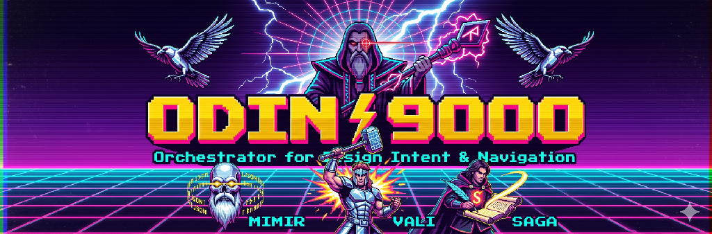

# Odin Flow



A GitHub Copilot agent skill suite for automating the Figma → Design System → Storybook pipeline. Powered by [Beads](https://github.com/gastownhall/beads) for persistent memory across agent sessions.

---

## Skills

### ODIN-9000 — Orchestrator for Design Intent & Navigation

```
.       .
        .   |   .       
    .   \   |   /   .   
     \   \  |  /   /    
  ____\   \ | /   /____
 █  ▄  █ █▀▀▄ █ █▄  █   ▄▀▀▄ ▄▀▀▄ ▄▀▀▄ █▀▀▄
 █  █  █ █  █ █ █ █ █   ▀▀▄█ █  █ █  █ █  █
 █  ▀  █ █▄▄▀ █ █  ▀█   ▀▀▀  ▀▀▀  ▀▀▀  ▀▀▀ 
  ‾‾‾‾/   / | \   \‾‾‾‾
     /   /  |  \   \
    '   /   |   \   '
        '   |   '
            '
```

The top-level orchestrator. Reads design intent from a Figma URL or brief, decides which sub-skills to run, and sequences them in dependency order. Records every decision in Beads for future sessions.

**Invoke:** `/odin-9000`  
**Pipeline:** MIMR → VALI → SAGA

---

### MIMR — Metadata Inventory & Mapping Repository

```
█▀▄▀█ █ █▀▄▀█ █▀▄
█ ▀ █ █ █ ▀ █ █▀▄
▀   ▀ ▀ ▀   ▀ ▀  ▀
```

Hybrid two-pass token audit engine. Combines Figma REST API + Token Studio shared plugin data with Plugin API native variable resolution to produce a merged conflict report and perform bulk token writes via mapping rules.

**Invoke:** `/mimr`  
**Inputs:** Figma frame URL + Personal Access Token  
**Outputs:** Token audit report, conflict detection, bulk write log  
**Use when:** Tokens have changed, bindings are missing, or a bulk migration is needed

---

### VALI — Visual Alignment & Layout Instantiator

```
█  █ █▀▀█ █    █
▀▄▄▀ █▄▄█ █    █
 ▀▀  ▀  ▀ ▀▀▀  ▀
```

Layout formatting engine. Converts Figma GROUPs and unwired FRAMEs into semantic auto-layout frames named using the `{direction / role}` convention (`section`, `group`, `pattern`). Prepares structure for MIMR token handoff.

**Invoke:** `/vali`  
**Inputs:** Figma frame URL  
**Outputs:** Converted + renamed auto-layout frames in Figma  
**Use when:** Layers are unstructured groups or absolute-position frames before tokenizing

---

### SAGA — Storybook Automation & Generative Asset

```
█▀▀▀ █▀▀█ █▀▀█ █▀▀█
▀▀▀█ █▄▄█ █ ▄▄ █▄▄█
▀▀▀▀ ▀  ▀ ▀▀▀▀ ▀  ▀
```

Code generation engine. Scaffolds semantic HTML + vanilla CSS + CSS Modules, **or** a StencilJS Web Component folder (`fds-{name}.tsx` + `fds-{name}.css` + `fds-{name}.stories.ts`) from a Figma Auto Layout node. Derives `--fds-*` CSS custom properties directly from native variable (NV) bindings — no hardcoded values. StencilJS output includes shadow DOM, typed `@Prop()` per variant axis, named slots, and a Storybook 9/10 CSF3 story file ready to drop into a Stencil project.

**Invoke:** `/saga`  
**Inputs:** Figma frame URL  
**Outputs (vanilla):** `{name}.html`, `{name}.css`, `{name}.module.css`  
**Outputs (StencilJS):** `fds-{name}/fds-{name}.tsx`, `fds-{name}.css`, `fds-{name}.stories.ts`  
**Use when:** A component is ready (post-VALI + post-MIMR) and code output or Storybook handoff is needed

---

## Memory — Beads

```
 ██████╗ ███████╗ █████╗ ██████╗ ███████╗
 ██╔══██╗██╔════╝██╔══██╗██╔══██╗██╔════╝
 ██████╔╝█████╗  ███████║██║  ██║███████╗
 ██╔══██╗██╔══╝  ██╔══██║██║  ██║╚════██║
 ██████╔╝███████╗██║  ██║██████╔╝███████║
 ╚═════╝ ╚══════╝╚═╝  ╚═╝╚═════╝ ╚══════╝
```

Every skill invocation is automatically tracked in [Beads](https://github.com/gastownhall/beads) — a Dolt-powered persistent issue tracker built for AI agents. This means:

- Agent context survives across chat sessions
- Every decision, conflict, and output is logged with a timestamp
- You can query history: `bd list`, `bd show <id>`
- Multi-session work picks up exactly where it left off

**Quick reference:**

```bash
bd ready                              # What can I work on?
bd create "fix button tokens" -p 1    # Create an issue
bd update <id> --claim                # Claim it
bd close <id> "done"                  # Complete it
bd dolt push                          # Sync to remote
```

---

## Setup

### Prerequisites

| Tool | Purpose | Required |
|------|---------|----------|
| VS Code 1.96+ | Editor | ✅ |
| GitHub Copilot (Individual / Business / Enterprise) | Agent runtime | ✅ |
| Figma MCP extension | Figma API bridge | ✅ |
| `bd` CLI | Beads issue tracker | ✅ |
| `beads-mcp` | Beads MCP server for Copilot | ✅ |
| Node.js + npm | For bd install via npm | ✅ |

---

### 1. Install Figma MCP in VS Code

> **Can this be automated?**  
> Partially — the `.vscode/mcp.json` in this repo pre-configures the Beads MCP server. The Figma MCP extension must be installed manually through the VS Code marketplace (extensions cannot be auto-installed by a repo).

**Steps:**

1. Open VS Code → Extensions (`Cmd+Shift+X`)
2. Search for **"Figma for VS Code"** (publisher: Figma)
3. Click **Install**
4. After install, open the Command Palette (`Cmd+Shift+P`) → **"Figma: Sign In"**
5. Authenticate with your Figma account

Alternatively via CLI:
```bash
code --install-extension figma.figma-vscode-extension
```

> The Figma MCP server starts automatically when you open a Copilot Chat session after signing in.

---

### 2. Get a Figma Personal Access Token (PAT)

MIMR uses the Figma REST API directly (for `sharedPluginData` access), which requires a PAT separate from the MCP login.

**Steps:**

1. Go to [figma.com](https://figma.com) → click your avatar (top-right) → **Settings**
2. Scroll to **Security** → **Personal access tokens**
3. Click **Generate new token**
4. Give it a name (e.g. `odinflow-agent`) and set expiry
5. Copy the token — it starts with `figd_`

> **Keep your PAT private.** Never commit it. When MIMR asks for `{pat}`, paste it directly in chat — it is never logged or stored by the skill.

---

### 3. Install Beads

Beads is a system-wide CLI tool — install it once, use it in any project.

#### Install `bd` CLI

**macOS / Linux (Homebrew — recommended):**
```bash
brew install beads
```

**npm:**
```bash
npm install -g @beads/bd
```

**Manual (if the above fail):**
```bash
# Download the binary for your platform from:
# https://github.com/gastownhall/beads/releases/latest
# Then move to your PATH, e.g.:
cp bd /usr/local/bin/bd && chmod +x /usr/local/bin/bd
```

#### Install `beads-mcp` (Copilot integration)

```bash
# Recommended (uv — manages its own Python)
curl -LsSf https://astral.sh/uv/install.sh | sh
uv tool install beads-mcp

# Or with pip (requires Python 3.10+)
pip install beads-mcp
```

#### Initialize Beads in this repo

```bash
cd odinflow
bd init --quiet --skip-hooks
```

This creates the `.beads/` database directory. The issue history lives here and is tracked by Dolt (version-controlled SQL).

#### Configure VS Code MCP

The `.vscode/mcp.json` in this repo is pre-configured. Update the paths to match your system:

```json
{
  "servers": {
    "beads": {
      "command": "/Users/<you>/.local/bin/beads-mcp",
      "env": {
        "BEADS_PATH": "/usr/local/bin/bd"
      }
    }
  }
}
```

Find your actual paths with:
```bash
which beads-mcp   # e.g. ~/.local/bin/beads-mcp
which bd          # e.g. /usr/local/bin/bd
```

#### Reload VS Code

```
Cmd+Shift+P → "Developer: Reload Window"
```

MCP servers load on window start. After reload, Beads tools will appear in Copilot Chat.

---

### 4. Clone and run

```bash
git clone git@github.com:katbinaris/odinflow.git
cd odinflow

# Install bd + beads-mcp (see above)
bd init --quiet --skip-hooks

# Verify everything works
bd ready
```

Then open VS Code, reload the window, and type `/odin-9000` in Copilot Chat.

---

## Skill pipeline

```
User: "Figma URL or design brief"
          │
          ▼
     /odin-9000
    ┌─────────────────────────────────────────┐
    │  1. Assess scope                        │
    │  2. bd create + claim issue             │
    │         │                               │
    │         ▼                               │
    │      /mimr ──► token audit + writes     │
    │         │                               │
    │         ▼                               │
    │      /vali ──► layout conversion        │
    │         │                               │
    │         ▼                               │
    │      /saga ──► HTML + CSS or StencilJS  │
    │         │                               │
    │  3. bd close + dolt push                │
    └─────────────────────────────────────────┘
          │
          ▼
    Storybook-ready component folder
    (HTML/CSS or StencilJS Web Component)
    + full Beads audit trail
```

### Technical pipeline (SAGA detail)

```
┌─────────────────────────────────────────────────────────────────────┐
│                          FIGMA FILE                                  │
│                  (COMPONENT_SET + token bindings)                    │
└─────────────────────────┬───────────────────────────────────────────┘
                          │  Figma URL
                          ▼
                   ┌─────────────┐
                   │ /odin-9000  │  orchestrates, creates bd issue
                   └──────┬──────┘
                          │
          ┌───────────────┼───────────────┐
          ▼               ▼               ▼
   ┌─────────────┐ ┌─────────────┐ ┌─────────────┐
   │    MIMR     │ │    VALI     │ │    SAGA     │
   │  (tokens)   │ │  (layout)   │ │   (code)    │
   └──────┬──────┘ └──────┬──────┘ └──────┬──────┘
          │               │               │
          ▼               ▼               │
   Binds --fds-*    Converts GROUPs       │
   vars to Figma    to Auto Layout        │
   nodes via NV     frames, renames       │
                    layers:               │
                    {col/row / role}      │
                          │               │
                          └───────────────┤
                                          │  get_design_context
                                          │  (NV bindings + layout)
                                          ▼
                               ┌──────────────────────┐
                               │  Step 3 asks user:   │
                               │  Output format?      │
                               └──────────┬───────────┘
                                          │
                    ┌─────────────────────┼──────────────────────┐
                    ▼                     ▼                       ▼
           ┌──────────────┐    ┌────────────────────┐   ┌──────────────┐
           │   Vanilla    │    │     StencilJS      │   │    Both      │
           └──────┬───────┘    └─────────┬──────────┘   └──────┬───────┘
                  │                      │                      │
                  ▼                      ▼                      ▼
         ┌────────────────┐   ┌──────────────────────┐  (runs both
         │ {name}.html    │   │ fds-{name}/          │   branches)
         │ {name}.css     │   │   fds-{name}.tsx     │
         │ {name}         │   │   fds-{name}.css     │
         │  .module.css   │   │   fds-{name}         │
         └────────────────┘   │     .stories.ts      │
                              └──────────┬───────────┘
                                         │
                              ┌──────────▼───────────┐
                              │  @Component          │
                              │    tag: fds-{name}   │
                              │    shadow: true      │
                              │                      │
                              │  @Prop() type        │  ← variant axes
                              │  @Prop() context     │    from Figma
                              │                      │
                              │  render() {          │
                              │    <Host class=...>  │
                              │      <slot name="icon">   │
                              │      <slot name="content">│
                              │      <slot name="actions">│
                              │    </Host>           │  ← slots from
                              │  }                   │    user input
                              └──────────┬───────────┘
                                         │
                              ┌──────────▼───────────┐
                              │  .stories.ts         │
                              │                      │
                              │  meta: {             │
                              │    tags:['autodocs'] │
                              │    argTypes: {       │
                              │      type: select    │  ← from @Prop()
                              │      context: select │
                              │      iconSlot: text  │  ← from slots
                              │    }                 │
                              │  }                   │
                              │                      │
                              │  export Default      │
                              │  export Error        │  ← one story
                              │  export Alert  ...   │    per variant
                              └──────────┬───────────┘
                                         │
                                         ▼
                              ┌──────────────────────┐
                              │   Stencil project    │
                              │   src/components/    │
                              │                      │
                              │   storybook dev      │
                              │        │             │
                              │        ▼             │
                              │   [Autodocs page]    │
                              │   [Default story]    │
                              │   [Error story]  ... │
                              └──────────────────────┘
```

---

## Project structure

```
odinflow/
├── .beads/                        # Beads issue database (Dolt)
├── .github/
│   ├── copilot-instructions.md    # Global Copilot + Beads rules
│   └── prompts/
│       ├── odin-9000.prompt.md    # /odin-9000 entry point
│       ├── mimr.prompt.md         # /mimr entry point
│       ├── vali.prompt.md         # /vali entry point
│       ├── saga.prompt.md         # /saga entry point
│       ├── odin-9000/
│       │   └── odin-9000.prompt.md
│       ├── mimr/
│       │   ├── mimr.prompt.md
│       │   ├── data/              # token-registry, mapping-rules, token-index
│       │   └── scripts/           # resolve.figma.js, bulk-update.figma.js
│       ├── vali/
│       │   ├── vali.prompt.md
│       │   ├── data/              # layout-rules.md
│       │   └── scripts/           # scan.figma.js, process.figma.js
│       └── saga/
│           └── saga.prompt.md
├── .vscode/
│   └── mcp.json                   # Beads MCP server config
├── AGENTS.md                      # Agent workflow reference
└── CLAUDE.md                      # Claude Code integration
```

---

## Designer → Engineer handoff

### The designer's journey

```
  THE DESIGNER'S JOURNEY
  ──────────────────────────────────────────────────────────────────


   FIGMA                          VS CODE                  STORYBOOK
   ──────                         ───────                  ─────────

  ┌──────────────────┐
  │                  │   "Here's my
  │  Component       │    Figma link"
  │  designed with   │ ──────────────►  /odin-9000
  │  tokens + layout │                      │
  │                  │                      │
  └──────────────────┘                      │

  ┌──────────────────┐            ┌─────────▼──────────────────────┐
  │                  │◄───────────│                                │
  │  Tokens are      │  binds     │  Reads the design              │
  │  connected to    │  colours,  │  Checks token coverage         │
  │  the right       │  spacing,  │  Fills any gaps                │
  │  design values   │  radius    │                                │
  │                  │            └─────────┬──────────────────────┘
  └──────────────────┘                      │

  ┌──────────────────┐            ┌─────────▼──────────────────────┐
  │                  │◄───────────│                                │
  │  Layers are      │  renames   │  Reads the layout              │
  │  named and       │  + fixes   │  Converts loose groups         │
  │  structured      │  layout    │  into structured frames        │
  │  consistently    │            │                                │
  │                  │            └─────────┬──────────────────────┘
  └──────────────────┘                      │
                                            │
                                   "What format do
                                    you need?"
                                            │
                              ┌─────────────┴─────────────┐
                              │                           │
                              ▼                           ▼
                       For the web team            For Storybook
                       ─────────────              ─────────────
                       HTML + CSS files           Web Component
                       ready to paste             with all variants
                       into any project           as interactive
                                                  controls
                                                       │
                                                       ▼

                                            ┌──────────────────────┐
                                            │  ● Default           │
                                            │  ● Error             │
                                            │  ● Alert             │
                                            │  ● Info              │
                                            │                      │
                                            │  [ type    ▼ ]       │
                                            │  [ context ▼ ]       │
                                            │  [ icon slot ... ]   │
                                            │                      │
                                            │  Auto-generated      │
                                            │  documentation page  │
                                            └──────────────────────┘


  ──────────────────────────────────────────────────────────────────
  THE HANDOFF

  Designer                                        Engineer
  ────────                                        ────────

  Opens a pull request                            Opens Storybook
  with a link to the                              Sees every variant
  Figma component                                 as a live story
        │                                                │
        │           No Figma access needed              │
        │           No spec-reading needed    ◄──────────┘
        │           Spacing and colour are
        │           already in the code
        │
        └─── One conversation.  One source of truth.  No back-and-forth.
```

SAGA is the bridge between design and engineering. Once MIMR has bound tokens and VALI has structured the layers, a designer can run `/saga` on any Figma component and produce a folder that drops directly into an existing Stencil project.

### What gets generated

```
src/components/fds-notification-banner/
  fds-notification-banner.tsx       ← Stencil Web Component (shadow DOM)
  fds-notification-banner.css       ← scoped styles, --fds-* vars only
  fds-notification-banner.stories.ts ← Storybook 9/10 CSF3 story
```

The story uses `@storybook/web-components` + `lit` html renderer and includes:
- `argTypes` auto-populated from Figma variant axes (`@Prop() type`, `@Prop() context`…)
- Named slot args exposed as Storybook controls
- `tags: ['autodocs']` for the auto-generated docs page
- One named story per primary variant (Success, Error, Alert…)

Storybook picks up the story automatically if the project's `stories` glob covers `src/components/**/*.stories.ts` — no manual import needed.

### Handoff steps

```
Designer (Figma + VS Code)              Engineer (codebase)
────────────────────────────────────────────────────────────
1. /odin-9000 on Figma URL
   └─ MIMR  → tokens bound in Figma     Token values = source of truth
   └─ VALI  → layout structured          Layer semantics documented
   └─ SAGA  → component folder written   Drop into src/components/
                                          storybook dev
                                          Component renders in isolation
                                          Controls = every @Prop()

2. Designer opens PR linking Figma URL

3. Engineer reviews story in Storybook,
   wires component into consuming app
```

### What the engineer does NOT need to derive manually

| Normally manual | With SAGA output |
|---|---|
| Translate Figma padding/gap → CSS | Already `var(--fds-container-card)`, `var(--fds-gap-v-group)` |
| Determine variant prop names | `@Prop() type`, `@Prop() context` typed as unions |
| Write Storybook `argTypes` | Already in the story, controls auto-populated |
| Decide slot names | Declared in the SAGA session, wired in `render()` |
| Inspect Figma for border-radius/elevation | Already `var(--fds-container-reg)`, bound elevation annotation |

---

## License

© 2026. All rights reserved.

This project is licensed under the **PolyForm Noncommercial License 1.0.0**.  
You may use, modify, and share this software for **non-commercial purposes only**.  
Commercial use of any kind requires explicit written permission from the author.

See [LICENSE](./LICENSE) for full terms.
