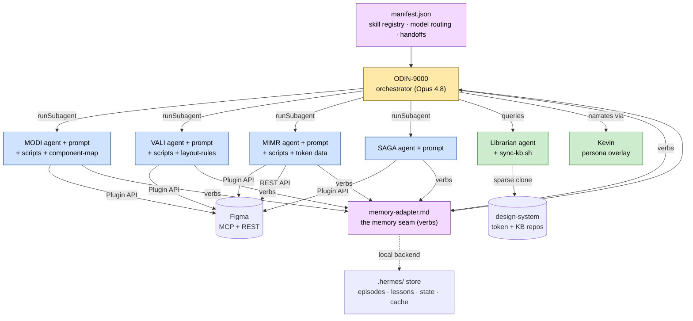
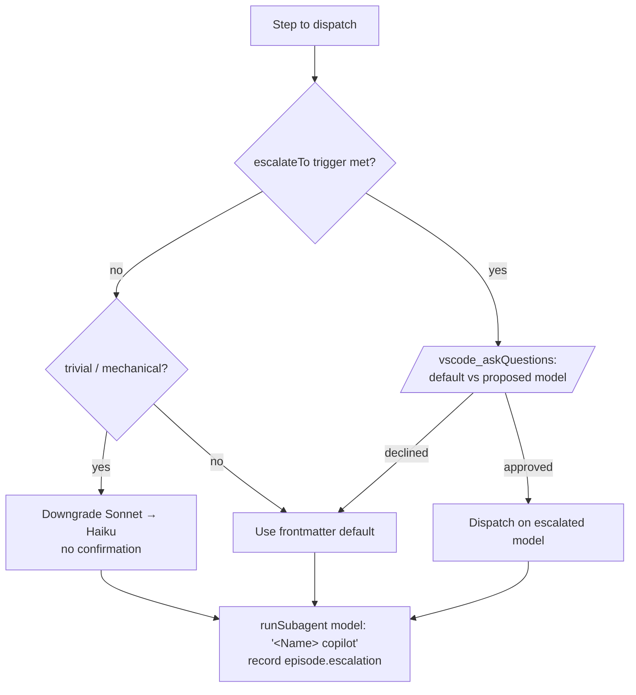
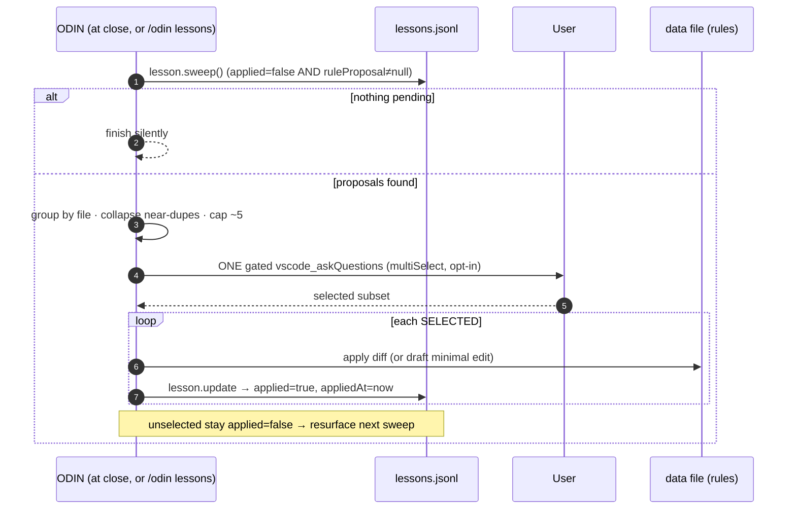
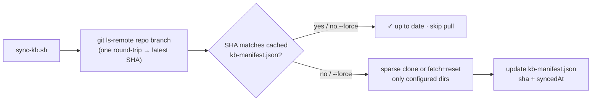
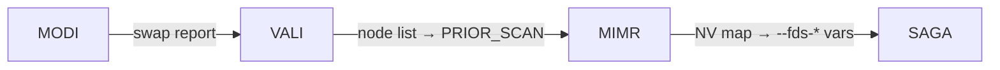

# ODIN Flow — Internals

> **Audience:** engineers who want to *understand and extend* ODIN Flow.
> For how to run it, see [../use/USAGE.md](../use/USAGE.md).

ODIN Flow is a set of GitHub Copilot **agent skills** (prompt files + Figma Plugin API scripts +
rule data) coordinated by an orchestrator, with a local file-based memory harness (Hermes). There
is no server and no build step — everything is Markdown, JSON, JS scripts, and JSONL state under
`.github/`.

---

## Table of contents

1. [Architecture overview](#1-architecture-overview)
2. [Repository layout](#2-repository-layout)
3. [The manifest contract](#3-the-manifest-contract)
4. [Prompt & agent structure](#4-prompt--agent-structure)
5. [ODIN orchestration loop](#5-odin-orchestration-loop)
6. [Model routing & escalation](#6-model-routing--escalation)
7. [The Hermes harness](#7-the-hermes-harness)
8. [Self-improvement loop (lesson reconciliation)](#8-self-improvement-loop-lesson-reconciliation)
9. [Librarian & sync-kb.sh](#9-librarian--sync-kbsh)
10. [Token model — TS vs NV](#10-token-model--ts-vs-nv)
11. [Scripts API reference](#11-scripts-api-reference)
12. [Data file formats](#12-data-file-formats)
13. [Handoff contracts](#13-handoff-contracts)
14. [Extending the system](#14-extending-the-system)
15. [Conventions & invariants](#15-conventions--invariants)
16. [Glossary](#16-glossary)

---

## 1. Architecture overview



Three layers:

- **Metadata** — `manifest.json` (the registry ODIN reads first) and `memory-adapter.md` (the only
  file that knows where memory physically lives).
- **Orchestrator** — ODIN-9000 runs the Plan→Choose→Execute→Observe→Refine loop and dispatches
  workers as isolated subagents.
- **Workers + support** — MODI, VALI, MIMR, SAGA do the Figma work; Librarian answers token/KB
  lookups; Kevin overlays narration.

---

## 2. Repository layout

```text
.github/
  copilot-instructions.md        # Skill Execution Protocol (manifest→open→recall→work→observe→close)
  agents/
    librarian.agent.md           # worker agent definitions (frontmatter + Boot block)
    modi.agent.md
    vali.agent.md
    mimr.agent.md
    saga.agent.md
  prompts/
    manifest.json                # ← read FIRST on every invocation
    kevin.prompt.md              # persona overlay
    odin-9000/odin-9000.prompt.md
    modi.prompt.md               # thin stub → modi/modi.prompt.md
    modi/
      modi.prompt.md             # full prompt (single source of truth)
      scripts/  scan-wireframe.figma.js · swap.figma.js
      data/     component-map.md
    vali/
      vali.prompt.md
      scripts/  scan.figma.js · process.figma.js
      data/     layout-rules.md
    mimr/
      mimr.prompt.md
      scripts/  audit-resolve-digest.figma.js · audit.figma.js · resolve.figma.js
                bulk-update.figma.js · token-lookup.py
      data/     token-registry.md · token-index.json · mapping-rules.md
    saga/
      saga.prompt.md
    .hermes/
      memory-adapter.md          # the seam
      episodes.jsonl             # run journal (committed)
      lessons.jsonl              # distilled insights (committed)
      sync-kb.sh                 # Librarian mirror refresh
      state/<runId>.json         # live run state (gitignored)
      cache/<key>.json           # version-keyed caches (gitignored)
AGENTS.md · CLAUDE.md            # agent-facing repo rules (Hermes integration)
README.md                        # entry point
docs/use/USAGE.md · docs/tech/INTERNALS.md
src/components/fds-*/            # SAGA output lives here
```

Each skill is a folder triplet: a **prompt** (instructions), **scripts** (Figma Plugin API code
the prompt injects and runs), and **data** (rules the prompt/scripts consume). The thin
`*.prompt.md` stubs at the `prompts/` root are the slash-command entry points that redirect to the
full prompt.

---

## 3. The manifest contract

`.github/prompts/manifest.json` is the registry every invocation reads first. It is intentionally
tiny so it is never skipped; full prompts and scripts load lazily.

### `skills.<name>`

| Field | Meaning |
|---|---|
| `role` | One-line purpose. |
| `prompt` | Path to the full `.prompt.md` (null for ODIN's own entry / Librarian). |
| `agent` | Path to the `.agent.md` subagent definition (null for ODIN + Kevin). |
| `model` | Durable default model (mirrors the agent frontmatter). |
| `escalateTo` | Optional `{ "<Model>": "trigger condition" }` — a per-task upgrade. |
| `scripts` | Array of `.figma.js` / `.py` files the worker must read before any Plugin API call. |
| `data` | Array of rule/reference files (`.md` / `.json`). |
| `loadWhen` | Human-readable trigger describing when ODIN should run this skill. |
| `controls` | (ODIN only) slash subcommands — `/odin lessons`, `/odin refine`. |
| `sync` | (Librarian only) external repo coordinates for `sync-kb.sh`. |

### Top-level blocks

- **`modelRouting`** — `orchestrator`, `defaults` (per-skill model map), `escalation` rule,
  `escalationSafetyGate` (mandatory approval before any upgrade), and `runSubagentFormat`
  (`"<Model Name> (copilot)"`). See [§6](#6-model-routing--escalation).
- **`pipelineOrder`** — `["modi", "vali", "mimr", "saga"]`, the sequence when all are needed.
- **`handoffContracts`** — the short strings describing what each stage forwards to the next. See
  [§13](#13-handoff-contracts).
- **`bundle`** — a mirror of a Hermes "skill-bundle" (`{name, description, skills[], instruction}`)
  so the manifest can be emitted verbatim when syncing to a real Hermes install.

---

## 4. Prompt & agent structure

### Two-tier prompts

Each worker has **two** prompt files:

- **Thin stub** — `.github/prompts/<name>.prompt.md`. The user-facing `/`-command entry point;
  ~frontmatter plus a redirect link to the full prompt.
- **Full prompt** — `.github/prompts/<name>/<name>.prompt.md`. The actual working document and the
  single source of truth, loaded by the agent at dispatch.

ODIN does **not** load full prompts at startup — only the manifest and adapter. A worker loads its
own full prompt when ODIN dispatches it.

### `.agent.md` frontmatter

```yaml
---
name: "MIMR"
description: "MIMR worker subagent … NOT FOR: HTML/CSS code generation"
model: "Claude Sonnet 4.6"          # durable default
tools: [read, search, execute, figma/*]
user-invocable: false                # true only for entry-point agents
argument-hint: "Figma frame URL or node id + scope"
---
```

### The Boot block (every agent, in order)

Every worker agent runs the same boot sequence — this is what guarantees the manifest, memory
seam, and lessons are always loaded before work:

```text
## Boot (every invocation, in order)
1. Read .github/prompts/manifest.json → resolve your file list under skills.<name>.
2. Read .github/prompts/.hermes/memory-adapter.md.
3. lesson.recall(["<name>"]) and honour returned lessons.
4. Load and follow .github/prompts/<name>/<name>.prompt.md — single source of truth.

## Self-check gate (before the FIRST Plugin API call)
Verify skills.<name>.scripts were read this session; read any you skipped.
Never write ad-hoc Plugin API code.
```

The **self-check gate** is the enforcement point for "always use the tested scripts" — a worker
must confirm it actually read its scripts before issuing any `use_figma` call.

---

## 5. ODIN orchestration loop

`.github/prompts/odin-9000/odin-9000.prompt.md` implements a Plan→Choose→Execute→Observe→Refine
loop wrapped in Hermes open/close bookkeeping.

```mermaid
sequenceDiagram
    autonumber
    participant U as User
    participant O as ODIN-9000
    participant M as Memory (Hermes)
    participant W as Worker subagent
    participant F as Figma

    Note over O: Pre-flight (§0)
    O->>O: 0a read manifest.json + memory-adapter.md
    O->>F: 0b get_metadata probe (MCP live?)
    O->>O: 0c load .odin-session (PAT + last frame) or ask

    O->>M: 1 OPEN run — state.write + episode.append open
    O->>M: 2 PLAN — lesson.recall odin; write state.plan
    loop per planned step
        O->>O: 3 CHOOSE next step + resolve model
        O->>W: EXECUTE — runSubagent(model:"<Name> (copilot)")
        W->>F: Plugin API / REST
        W-->>O: digest
        O->>M: 4 OBSERVE — append observations/openIssues; lesson.append
        O->>O: 5 REFINE — update plan if findings invalidate it
    end
    O->>M: 6 CLOSE — episode.append close + lesson.sweep reconcile
    O-->>U: summary + open issues
```

### Pre-flight (§0, once per session)

- **§0a Manifest load** — read `manifest.json` and `memory-adapter.md`. Always first; never skipped.
- **§0b Figma MCP check** — a `get_metadata` connectivity probe on the target frame. If it fails,
  ODIN asks you to sign in or skip Figma (MIMR REST-only mode is still possible with a PAT). When no
  frame is known yet, the probe defers to the first `get_metadata` in §0c.
- **§0c PAT + frame collection** — load `.odin-session`, or ask for the PAT + frame and save it
  (ensuring `.odin-session` is gitignored first). On `401`/`403`, delete the session and re-ask.

### The loop (§1–6)

1. **Open** — `runId = odin-<yyyymmdd-hhmmss>`; `state.write(...)`; `episode.append({phase:"open"})`.
2. **Plan** — `lesson.recall(["odin"])`; decide scope; write ordered `state.plan[]` per `pipelineOrder`.
3. **Choose → Execute** — take the next unfinished step, resolve its model, dispatch via
   `runSubagent` passing only the needed state slice + handoffs; `episode.append({phase:"step"})`.
4. **Observe** — append the worker's digest to `state.observations[]`, record `state.openIssues[]`,
   `state.write`, and `lesson.append` any corrected paths / perf insights.
5. **Refine** — if observations invalidate the plan, update `state.plan[]` and continue.
6. **Close** — set `status:"done"` + `outcome` + `summary`; `episode.append({phase:"close"})`;
   **then run the lesson sweep** (see [§8](#8-self-improvement-loop-lesson-reconciliation)).
   *Closing always means close **and** reconcile.*

Dispatch passes only the slice a worker needs plus handoff data — workers run in isolated context
and return compact digests, keeping the orchestrator context small.

---

## 6. Model routing & escalation



### Defaults

| Skill | Default | Escalates to | Trigger |
|---|---|---|---|
| Librarian | Claude Haiku 4.5 | — | — |
| MODI | Claude Haiku 4.5 | Claude Sonnet 4.6 | ambiguous variant mapping / non-trivial resolution |
| VALI | Claude Sonnet 4.6 | — | — |
| MIMR | Claude Sonnet 4.6 | Claude Opus 4.8 | large or ambiguous conflict audit |
| SAGA | Claude Sonnet 4.6 | Claude Opus 4.8 | complex multi-state / multi-variant codegen |
| **ODIN** | **Claude Opus 4.8** | — | — |

### Resolution order

1. **Per-task escalation** — if the step matches `skills.<name>.escalateTo`, the escalated model is
   a *candidate* (requires approval, below).
2. **Frontmatter default** — otherwise the agent's pinned `model:`.
3. **Downgrade** — for trivial steps a Sonnet default may drop to Haiku (no confirmation).

### Escalation safety gate (MANDATORY)

> Before dispatching any subagent on a model **higher** than its frontmatter default, ODIN MUST ask
> the user via `vscode_askQuestions` and receive explicit approval. Applies to every upgrade
> (Haiku→Sonnet, Sonnet→Opus). No silent escalation.

On decline, ODIN dispatches on the frontmatter default (never blocks the step). Downgrades are
exempt. The outcome is recorded as `episode.escalation = { from, to, approved }`. The resolved name
is passed to `runSubagent` as `model: "<Name> (copilot)"`.

---

## 7. The Hermes harness

The **Hermes harness** is a local, file-based memory system reached through a single seam:
`.github/prompts/.hermes/memory-adapter.md`. Skills **never** touch `.hermes/` paths directly —
they call verbs. Only the adapter's "Backend binding" table knows the physical location, so a
later migration to an external Hermes service changes only that table.

### Verbs

| Verb | Signature → returns | Local backend |
|---|---|---|
| `state.read(runId)` | `(runId) → StateObject` | read `state/<runId>.json` |
| `state.write(runId, obj)` | `(runId, obj) → void` | write `state/<runId>.json` |
| `episode.append(ev)` | `(ev) → void` | append one line to `episodes.jsonl` |
| `lesson.append(le)` | `(le) → void` | append one line to `lessons.jsonl` |
| `lesson.recall(tags)` | `(tags[]) → Lesson[]` | grep `lessons.jsonl` by `skill`/`tags` |
| `lesson.sweep(filter?)` | `(filter?) → Map<file, Lesson[]>` | entries with `applied=false` **and** non-null `ruleProposal`, grouped by `ruleProposal.file`, near-dupes collapsed (same `skill`+`file`+similar `lesson`) |
| `lesson.update(matcher, patch)` | `(matcher, patch) → void` | in-place JSONL rewrite — read all, patch matched object(s), write back (one object per line) |
| `cache.read(key)` | `(key) → CacheEntry` | read `cache/<key>.json` |
| `cache.write(key, obj)` | `(key, obj) → void` | write `cache/<key>.json` |
| `cache.valid(key, ver)` | `(key, ver) → bool` | compare stored `version` vs `ver` |

`BACKEND=local` is the only supported value today.

### Store layout & what is committed

```text
.hermes/
  memory-adapter.md      # the seam
  episodes.jsonl         # run journal               (COMMITTED)
  lessons.jsonl          # distilled insights        (COMMITTED)
  state/<runId>.json     # live run state            (gitignored — volatile)
  cache/<key>.json       # version-keyed caches      (gitignored — rebuildable)
  cache/kb-manifest.json # synced repo SHAs          (gitignored)
```

`episodes.jsonl` and `lessons.jsonl` are committed (they are the durable audit trail and learned
knowledge). `state/` and `cache/` are gitignored via `state/.gitignore` and `cache/.gitignore`
(`*` with a `!.gitkeep` exception).

### Schemas

**State — `state/<runId>.json`**

| Field | Meaning |
|---|---|
| `runId` | `odin-<yyyymmdd-hhmmss>`. |
| `goal` | One-line objective. |
| `frameUrl` / `fileKey` / `nodeId` | Figma target coordinates. |
| `patRef` | Reference to the PAT (`".odin-session"`) — **never inline the token**. |
| `plan[]` | `{ skill, why }` planned steps. |
| `done[]` | `{ skill, digest/digestRef, at }` completed steps. |
| `observations[]` | Findings from the Observe phase. |
| `openIssues[]` | Unfinished work — triggers a new `runId` if continued. |
| `status` | `active \| paused \| done \| cleared`. |
| `outcome` | (set at close) `complete \| blocked \| failed \| timeout \| reclaimed`. |
| `summary` | One-line handoff for the next worker. |

**Episode — one line in `episodes.jsonl`**

```json
{ "ts": "ISO8601", "runId": "...", "skill": "mimr", "phase": "close",
  "summary": "Bound 308 nodes, 2 conflicts resolved", "result": "ok",
  "outcome": "complete", "writes": 308, "frame": "FDS-Badge" }
```

`phase ∈ open | step | observe | close`. `result ∈ ok | error` (execution status). `outcome`
is present only at `close`. An `open`+`close` pair is the minimal audit record — every Figma write
needs one.

**Lesson — one line in `lessons.jsonl`**

```json
{ "ts": "ISO8601", "skill": "mimr", "tags": ["padding","conflict"],
  "trigger": "what went wrong / was corrected",
  "lesson": "actionable rule, imperative voice",
  "ruleProposal": { "file": "mimr/data/mapping-rules.md", "diff": "optional unified diff" },
  "applied": false, "appliedAt": null }
```

`trigger` is the diagnosis; `lesson` is the imperative rule; `ruleProposal` (optional) points at a
data file to update (`diff` optional — if null the agent drafts the edit). `applied` is the
reconciliation flag (missing = `false`); `appliedAt` is stamped by `lesson.update` on promotion.

> **JSONL invariant:** `lesson.update` must preserve exactly one JSON object per line and never
> reorder or drop other lines. After any rewrite the file must still parse line-by-line.

**Cache — `cache/<key>.json`**

```json
{ "key": "vars-<fileKey>-<version>", "version": "<figma file version>",
  "builtAt": "ISO8601", "data": { } }
```

Key convention `<kind>-<fileKey>-<nodeId?>-<version>`. `cache.valid` returns false when the stored
`version` ≠ the supplied `ver`, forcing a rebuild.

### Why these names

The local backend deliberately mirrors a future external Hermes: a `runId` maps to a
`kanban_db.Run` row (open/close = claim/close; `outcome`/`summary`/`error` are the same columns),
and the ODIN loop mirrors the Hermes "Ralph loop" (`goals.py`) — hence `state.status` reuses
`active|paused|done|cleared`. Keeping the analogy intact makes the eventual swap a near drop-in.

---

## 8. Self-improvement loop (lesson reconciliation)

Recalling and appending lessons is only half the loop. The other half **promotes** pending lessons
into the rule files that actually drive behaviour — gated by user approval.



The pass, in five steps:

1. **Sweep** — `lesson.sweep()` collects `applied=false` + non-null `ruleProposal`, grouped by
   target file, near-duplicates collapsed, capped to ~5 most recent groups.
2. **Empty?** — if nothing pending, finish silently (no prompt, no noise).
3. **Gate** — render **one** `vscode_askQuestions` multiSelect listing each proposal as
   `skill · file · one-line lesson`. Default = none selected (opt-in, never opt-out).
4. **Apply** — for each selected proposal, write its `diff` to the target file (or draft a minimal
   edit), then `lesson.update` that line to `applied:true` + stamp `appliedAt`.
5. **Defer** — unselected proposals stay `applied:false` and resurface on the next sweep.

**Rules:** rule files are **never** auto-written without approval; the pass is **idempotent** (once
`applied:true`, a lesson no longer matches the sweep filter); it runs at every run close **and** on
demand via `/odin lessons` (or `/odin refine`), which open their own `open → close` episode pair.

Target data files for promotion: `mimr/data/mapping-rules.md`, `vali/data/layout-rules.md`,
`modi/data/component-map.md`.

---

## 9. Librarian & sync-kb.sh

Librarian is a read-only subagent that owns the large external Token Studio JSON and KB docs behind
a narrow query interface — it returns matched rows, never whole files, so multi-megabyte sources
never enter context.

It keeps a **local mirror** under `.hermes/cache/`, refreshed by `sync-kb.sh` with a cheap
staleness check.



### Configuration

Coordinates live in `manifest.json → skills.librarian.sync` (and as env-overridable defaults in the
script header):

| Source | Repo | Branch | Path |
|---|---|---|---|
| Token JSON | `<org>/core-design-system-variables` | `main` | `data` |
| KB docs | `<org>/kb-docs` | `feat/fds-token-docs-refactor` | `knowledge/shared/global/design-standards/tokens` |

Clone target: `.github/prompts/.hermes/cache`; manifest: `cache/kb-manifest.json`.

### Behaviour

```bash
bash .github/prompts/.hermes/sync-kb.sh          # pull only if remote SHA differs
bash .github/prompts/.hermes/sync-kb.sh --force   # always re-pull
```

- **Staleness probe** — `git ls-remote <url> refs/heads/<branch>` vs the cached SHA in
  `kb-manifest.json`. Up to date → prints `✓ <key>: up to date` and skips.
- **Sparse checkout** — `clone --depth 1 --filter=blob:none --sparse` then
  `sparse-checkout set <paths>` so only the token/KB directories are fetched.
- **Auth** — uses existing `gh`/SSH credentials; no tokens are stored in the repo.

### Cache layout

```text
.hermes/cache/
  tokens/data/      ts-core-fabric.json, ts-alta-fabric.json, …
  kb/knowledge/shared/global/design-standards/tokens/   *.md
  kb-manifest.json  { tokens:{sha,path,syncedAt}, kb:{…} }
```

### Gotchas

- Sparse-checkout takes **directories**, not globs: `sparse-checkout set data` ✓, `data/*` ✗.
- The KB default branch renamed `index.md` → `tokens.md`; the feat branch still uses `index.md` —
  pull from the configured feat branch explicitly.
- The large `ts-*.json` files are not indexed by remote code search — they must be read from the
  local mirror.

---

## 10. Token model — TS vs NV

FDS tokens reach Figma nodes two ways, and MIMR handles both:

| | Token Studio (TS) | Native Variables (NV) |
|---|---|---|
| Storage | `node.getSharedPluginData('tokens', key)` | `node.boundVariables[prop]` |
| Shape | `{ key: "dot.path.value" }` | `{ prop: VariableID | [VariableID] }` |
| Read by | Figma REST API (`plugin_data=shared`) + Plugin API | Plugin API (`getVariableByIdAsync`) |
| Example key | `fill`, `verticalPadding`, `borderRadius` | `fills`, `paddingTop`, `cornerRadius` |

A TS value prefixed `var.fds.*` signals **intended NV binding** — MIMR converts the dot path to a
slash path, resolves the variable by name, and binds it. When a TS path maps 1:1 to an NV variable
name, the NV binding alone is sufficient (the TS write can be skipped). MIMR's two-pass design
(audit → resolve → write) exists to reconcile these two systems and flag conflicts (same property,
different TS vs NV value).

---

## 11. Scripts API reference

### Execution pattern

Scripts are Figma **Plugin API** programs run through the `use_figma` MCP tool. The pattern:

1. **Read the script once per session** (the self-check gate enforces this) and cache its text.
2. **Prepend an injection block** of constants (e.g. `ROOT_ID`, `MODE`, `OPS`, `RULES`).
3. **Run** via `use_figma` with the `fileKey`; the script returns a JSON string.
4. **Parse** the JSON and merge into results.

Scripts batch async calls (chunks of 50–100), build a `nodeCache` at startup to avoid `findOne` in
loops, and skip INSTANCE children (read-only). Where a variable-ID cache exists
(`cache.valid("vars-<fileKey>-<version>")`), the resolved IDs are injected so the script avoids the
slow `getLocalVariablesAsync()`.

### MIMR scripts

**`audit-resolve-digest.figma.js`** — default for audit-only (Phase 1+1b combined: tree walk +
variable resolution + anomaly detection in one pass).

```js
// injection
const ROOT_ID    = "8866:76128";  // COMPONENT_SET or FRAME (colon format)
const MAX_DEPTH  = 4;
const SAMPLE_IDS = null;          // null = all; ["id", …] = sampled variants
const PRIOR_SCAN = null;          // [{id,type}, …] from VALI → skip the tree walk
```

Returns (target < 8 KB):

```json
{
  "root":   { "id": "", "name": "", "type": "", "childCount": 0 },
  "stats":  { "total": 0, "withTS": 0, "withNV": 0, "conflicts": 0,
              "instances": 0, "unbound": 0, "sampled": 0 },
  "varMap": { "VariableID:abc": "shortName" },
  "matrix": [ { "variant": "", "n": 0, "fill_ts": "", "fill_nv": "",
                "border_ts": "", "border_nv": "", "text_fill_ts": "", "text_fill_nv": "" } ],
  "sizes":  [ { "size": "", "n": 0, "vpad_ts": "", "vpad_nv": "", "hpad_ts": "", "hpad_nv": "",
                "gap_ts": "", "gap_nv": "", "radius_ts": "", "radius_nv": "",
                "stroke_ts": "", "stroke_nv": "", "typography_ts": "" } ],
  "issues": [ { "code": "", "severity": "", "scope": "", "detail": "", "affectedCount": 0 } ],
  "fromPriorScan": false
}
```

Issue codes: `MISSING_NV_FILL`, `RAW_REF_BORDER`, `RAW_REF_FILL`, `TS_NV_CONFLICT`, `MISSING_TS`,
`SHARED_RADIUS`, `TYPOGRAPHY_SHARED`.

**`audit.figma.js`** — Phase 1 raw tree walk (used when Phase 3 writes are planned; returns the full
node list). Same `ROOT_ID/MAX_DEPTH/SAMPLE_IDS/PRIOR_SCAN` injection; returns
`{ root, variantGroupProperties, nodes:[{id,name,type,parentName,depth,ts,nv}], varIds, stats, fromPriorScan }`,
where `ts = { key: { raw, short } }` and `nv = { prop: varId | [varId] }`. With `PRIOR_SCAN` it
skips the walk and batches `getNodeByIdAsync()` in chunks of 50.

**`resolve.figma.js`** — Phase 1b. Injects `VAR_IDS[]` + `NODE_IDS[]`; resolves variable IDs to
names and reads `boundVariables`, returning
`{ varMap:{ id:{name,collection,type,remote} }, nodeBindings:[{id,name,type,resolved:{prop:[{varId,name,collection,type}]}}] }`.

**`bulk-update.figma.js`** — Phase 3 write engine. Injects `ROOT_ID` + `RULES[]` (and optional
`CACHE_VAR_IDS` / `CACHE_STYLE_IDS`). Rule shape:

```js
{
  id: "rule-id",
  layerPattern: "pattern",
  matchType: "exact|contains|regex",
  writes: [
    { type: "ts",     key: "fill", value: "var.fds.fds-surface-variant", rawValue: "#1a1a2e" },
    { type: "nv",     prop: "fills", varId: "VariableID:…" },
    { type: "border", widthToken: "…", colorToken: "…" }
  ]
}
```

It writes TS via `setSharedPluginData('tokens', key, …)`, auto-resolves a matching NV binding
(TS dot-path → slash-path → `setBoundVariable()`), detects gradient paint styles, and falls back to
the raw CSS value when no NV exists. TS→NV property map includes `fill→fills`,
`borderRadius→cornerRadius`, `borderWidth→strokeWeight`, `horizontalPadding→[paddingLeft,paddingRight]`,
`verticalPadding→[paddingTop,paddingBottom]`, `itemSpacing`, `opacity`, `width/height`. Existing NV
bindings are never cleared. Returns `{ applied, failed, report:[{rule,nodeId,nodeName,type,status,before?,after?,error?}] }`.

**`token-lookup.py`** — a terminal CLI (not injected) for offline token search over
`ts-core-fabric.json`:

```bash
python3 token-lookup.py "fds-stroke-const-int-rest"
python3 token-lookup.py "stroke-const" --type border --decompose
python3 token-lookup.py "*" --type border --decompose   # all borders
```

Emits compact JSON (one object per result, jq-friendly); `--decompose` splits composite border
tokens into `{ width:{tsRef,nvName}, color:{tsRef,nvName} }`.

### VALI scripts

**`scan.figma.js`** — Phase 1 layout scan with variant fingerprinting.

```js
const NODE_ID = "8373:54941";
const DEPTH   = 5;
const SAMPLE  = 0;  // 0 = scan all; N>0 = explicit sample count
```

For COMPONENT_SETs > 20 children it fingerprints every variant
(`"TYPE:LAYOUT_MODE:[childFP,…] | (childCount)"`), groups identical fingerprints, and scans only one
representative per group — returning `{ id, name, type, totalVariants, uniqueFingerprints, fingerprintGroups, sampled[] }`.

**`process.figma.js`** — Phase 2+3 OPS execution. Injects `NODE_ID` + `OPS[]` (+ optional `CHUNK_SIZE`).
OPS shapes:

```js
{ op: "ungroup",  id: "WRAPPER_ID" }
{ op: "wrap",     parentId: "P", childIds: ["A","B"], direction: "VERTICAL", name: "{col / pattern}" }
{ op: "al",       id: "N", direction: "VERTICAL", wrap: false, absoluteChildren: [] }
{ op: "rename",   id: "N", to: "{col / group}" }
{ op: "token",    id: "N", gap: "vPattern" }   // vSection|vGroup|vPattern|hPattern
{ op: "annotate", id: "N", oldName: "Inputs", newName: "{col / pattern}", direction: "col", childSummary: "3× FDS-Input" }
{ op: "template", parentId: "SET", targetType: "COMPONENT", childOps: [ … ] }
```

For `al`, `wrap:true` sets `layoutWrap='WRAP'` (HORIZONTAL only) and `absoluteChildren:[ids]` re-pins
those children to `layoutPositioning='ABSOLUTE'` after conversion. `template` replicates `childOps`
across all variants, substituting `{VARIANT_ID}` and `{CHILD:N:ID}` placeholders. Returns
`{ log:[{op,nodeId,status,result?}], failed:[{op,nodeId,reason}] }`.

### MODI scripts

**`scan-wireframe.figma.js`** — Phase 1 wireframe parse.

```js
const NODE_ID = "8914:78154";
const MODE = "parse";     // "parse" | "swap"
const SOURCE_KEY = null;  // swap mode only
const MAX_DEPTH = 10;
```

Placeholders are shape nodes (`RECTANGLE/ELLIPSE/LINE/POLYGON/STAR`) or childless FRAMEs with a
non-default name. Returns
`{ root, placeholders:[{id,name,type,w,h,parentId,index,sizing,textHint}], instances:[…], otherCount }`.
`textHint` is the characters of an overlapping TEXT node (or nearest sibling by centre distance) —
used as a name source when the placeholder's own name is generic.

**`swap.figma.js`** — Phase 2 swap. Injects `NODE_ID` + `SWAP_OPS[]` (+ `CHUNK_SIZE`):

```js
{ op: "create", targetId: "…", componentKey: "519c…", variantProps: { Size: "Medium" }, sizing: { h: "FILL", v: "HUG" } }
{ op: "swap",   targetId: "…", componentKey: "b47d…", variantProps: { Size: "Large", Type: "Primary" }, sizing: { … } }
```

`create` instantiates a component into a placeholder at its index; `swap` retargets `mainComponent`
and updates variant props. Both restore captured sizing. Returns
`{ log:[{op,targetId,targetName,componentName,status,result?}], failed:[{op,targetId,reason}] }`.

---

## 12. Data file formats

**`mimr/data/mapping-rules.md`** — Phase 3 write rules as YAML blocks plus markdown sections.

```yaml
- id: "rule-id"
  layer_pattern: "btn"
  matchType: "exact|contains|regex"
  writes:
    - type: ts
      key: "fill"
      value: "var.fds.fds-surface-variant"
      rawValue: "#1a1a2e"        # optional fallback
    - type: nv
      prop: "fills"
      varId: "VariableID:…"
    - type: border
      widthToken: "…"
      colorToken: "…"
```

A global section encodes theme-aware content-fill logic (the content fill token must match the
variant's surface context). Sections group rules by component family (Button, Input, Badge, Card…).

**`mimr/data/token-registry.md`** — human-readable token reference: one Markdown table per category
(`Short Name | Token Studio Path | Type | Native Variable Name | Description`). Look up with
`grep_search`; **never load the whole file**.

**`mimr/data/token-index.json`** — compact machine index:
`{ _schema, _source, _count, tokens: [[shortName, tsPath, type, nv?, desc?], …] }` for programmatic
lookups.

**`vali/data/layout-rules.md`** — classification + transformation rules: direction detection
(8 px tolerance), role classification (`pattern | group | section`), wrapping/ungrouping rules, and
sizing restoration. Decision tree: homogeneous → `pattern`; broken pattern → `group`; 2+ distinct
named sub-frames → `section`; all leaves → `pattern`.

**`modi/data/component-map.md`** — the resolution cache. YAML entries:

```yaml
- name: "FDS-Input"
  componentKey: "519c…"
  nodeId: "8556:55146"          # local only
  file: "Ahvbwk0dUHeHazrQX2XtGd" # local only
  library: "🧣 DS Fabric Components (WIP)"
  axes: { State: [Default, Filled, Error, Disabled], Size: [Small, Medium, Large] }
  defaultVariantKey: "b7357…"
  scanned: "2026-04-27"
```

Sections: Core Kit (pre-scanned), Discovered (auto-appended by MODI), Custom (user-provided URLs).

---

## 13. Handoff contracts

From `manifest.json → handoffContracts`:

- **`modi → vali`** — swap report; converted instances ready for the layout pass.
- **`vali → mimr`** — VALI's flat node list `[{id,type}]` is forwarded as `PRIOR_SCAN`, so MIMR's
  audit script skips its own tree walk and only fetches token data for the pre-identified nodes.
- **`mimr → saga`** — MIMR's resolved NV map `{prop: shortName, value}` is reused by SAGA to derive
  `--fds-*` CSS variables, with no re-resolution of variables.



These contracts are why the pipeline order is fixed and why running stages out of order wastes
Figma reads or loses bindings.

---

## 14. Extending the system

### Add a new skill

1. **Register it** in `manifest.json → skills.<name>` (`role`, `prompt`, `agent`, `model`,
   optional `escalateTo`, `scripts[]`, `data[]`, `loadWhen`). Add it to `pipelineOrder` and
   `bundle.skills` if it belongs in the chain.
2. **Create the agent** `.github/agents/<name>.agent.md` with frontmatter + the standard **Boot
   block** + a self-check gate.
3. **Create the prompts** — a thin stub `prompts/<name>.prompt.md` (redirect) and the full
   `prompts/<name>/<name>.prompt.md`.
4. **Add scripts** under `prompts/<name>/scripts/` following the inject-constants → return-JSON
   pattern, and any `data/` rule files.
5. **Update model routing** defaults if the agent isn't Sonnet.

### Add a mapping rule

Append a YAML block to `mimr/data/mapping-rules.md` (see [§12](#12-data-file-formats)). It is
consumed by `bulk-update.figma.js` as a `RULES[]` entry. Prefer letting the
[reconciliation loop](#8-self-improvement-loop-lesson-reconciliation) promote a recorded lesson so
the change is traceable to its `trigger`.

### Author a lesson with a rule proposal

When you discover a durable correction, `lesson.append` it with a `ruleProposal` pointing at the
data file to change (and an optional `diff`). It will surface at the next reconciliation sweep for
gated promotion — never auto-applied.

---

## 15. Conventions & invariants

- **Read `manifest.json` first** on every invocation — it is the tiny skill→files map.
- **The seam is sacred** — reach memory only through adapter verbs; never hardcode `.hermes/` paths
  outside `memory-adapter.md`.
- **One JSON object per JSONL line** — `lesson.update` and any rewrite must preserve this; the file
  must still parse line-by-line afterward.
- **`runId = odin-<yyyymmdd-hhmmss>`**; a mid-session request after close starts a **new** runId —
  never mutate a closed run.
- **Every Figma write needs an `open → close` episode pair.**
- **No PATs in any store file** — reference via `patRef` / `.odin-session` only.
- **Never write ad-hoc Plugin API code** — use the tested scripts; the self-check gate enforces it.
- **Never auto-write a rule file** — reconciliation is always gated by explicit approval.
- **No silent model escalation** — any upgrade above the frontmatter default needs user approval.

---

## 16. Glossary

| Term | Meaning |
|---|---|
| **ODIN-9000** | The orchestrator skill; runs the Plan→Choose→Execute→Observe→Refine loop. |
| **Worker** | A dispatched subagent (MODI/VALI/MIMR/SAGA) running in isolated context. |
| **Hermes harness** | The local file-based memory system under `.hermes/`. |
| **Seam** | `memory-adapter.md` — the single indirection point for memory. |
| **Verb** | A memory operation (`state.*`, `episode.*`, `lesson.*`, `cache.*`). |
| **Episode** | One `open/step/observe/close` audit line in `episodes.jsonl`. |
| **Lesson** | A durable insight in `lessons.jsonl`, optionally with a `ruleProposal`. |
| **Reconciliation** | The gated sweep that promotes pending lessons into rule files. |
| **TS / NV** | Token Studio (`sharedPluginData`) vs Native Variables (`boundVariables`). |
| **PRIOR_SCAN** | VALI's node list forwarded to MIMR to skip a tree walk. |
| **Fingerprint** | A structural signature VALI uses to dedupe identical variants. |
| **Placeholder** | A wireframe shape/childless-FRAME MODI resolves to a real component. |
