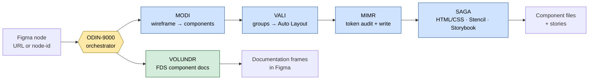
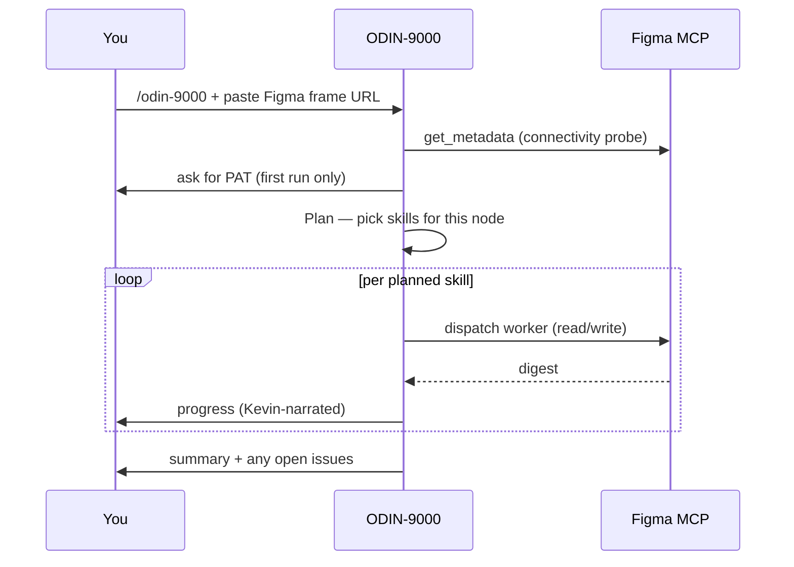

# ODIN Flow — Usage Guide

> **Audience:** engineers who want to _operate_ ODIN Flow.
> For how it works internally, see [../tech/INTERNALS.md](../tech/INTERNALS.md).

ODIN Flow is a GitHub Copilot agent skill suite that automates the
**Figma → Design System → Storybook** pipeline. You drive it from Copilot Chat in VS Code
with a single slash command and a Figma frame URL; an orchestrator (ODIN-9000) decides which
sub-skills to run and sequences them.

---

## Table of contents

1. [What it does](#1-what-it-does)
2. [Prerequisites](#2-prerequisites)
3. [Quickstart](#3-quickstart)
4. [The skills — what each does and when to use it](#4-the-skills)
5. [How you invoke them](#5-how-you-invoke-them)
6. [Worked examples](#6-worked-examples)
7. [Controls (ODIN + Kevin)](#7-controls)
8. [Session & PAT handling](#8-session--pat-handling)
9. [Troubleshooting](#9-troubleshooting)
10. [FAQ](#10-faq)

---

## 1. What it does

You point ODIN at a Figma node. Depending on what that node needs, ODIN runs some or all of
four worker skills in dependency order, then (optionally) hands you back component code.



You rarely run all four. ODIN picks the subset your node actually needs (see
[§4](#4-the-skills) and [§5](#5-how-you-invoke-them)).

---

## 2. Prerequisites

### 2.1 Figma for VS Code (the MCP bridge)

The skills read and write Figma through the **Figma for VS Code** extension's MCP server.

1. VS Code → Extensions (`Cmd+Shift+X`) → search **"Figma for VS Code"** (publisher: Figma) → **Install**.
2. Command Palette (`Cmd+Shift+P`) → **"Figma: Sign In"** → authenticate.

Or via CLI:

```bash
code --install-extension figma.figma-vscode-extension
```

> The Figma MCP server starts automatically when you open a Copilot Chat session after signing in.

### 2.2 A Figma Personal Access Token (PAT)

MIMR also talks to the Figma **REST API** directly (to read Token Studio `sharedPluginData`),
which needs a PAT separate from the MCP login.

1. [figma.com](https://figma.com) → avatar → **Settings** → **Security** → **Personal access tokens**.
2. **Generate new token**, name it (e.g. `odinflow-agent`), set an expiry.
3. Copy it — it starts with `figd_`.

> **Keep your PAT private.** Paste it directly when ODIN asks; it is referenced by file
> (`.odin-session`, gitignored), never printed back. See [§8](#8-session--pat-handling).

### 2.3 (Optional) Prime the Librarian mirror

Librarian answers token/KB lookups from a **local clone** of the external Token Studio JSON and
KB repos, so the large source files never enter the model context.

```bash
bash .github/prompts/.hermes/sync-kb.sh          # refresh only if the remote SHA changed
bash .github/prompts/.hermes/sync-kb.sh --force  # re-pull regardless of SHA
```

This sparse-checks-out only the token/KB directories into `.github/prompts/.hermes/cache/`
(gitignored) and records the synced SHAs in `cache/kb-manifest.json`.

> The design-system source repos are **private** — the sync needs authenticated git access
> (SSH key or `gh auth login`). Without access, Librarian falls back to the local
> `token-registry.md`.

### 2.4 Clone and open

```bash
git clone git@github.com:karlmalotabs/odin-9000-flow.git
cd odin-9000-flow
code .
```

---

## 3. Quickstart



1. Open Copilot Chat in VS Code.
2. Type `/odin-9000` and paste a Figma frame URL (or `file_key` + `node-id`).
3. On the **first run** ODIN asks for your PAT and saves a `.odin-session` (gitignored).
4. ODIN plans, runs the needed skills one at a time, and reports a summary plus any
   `openIssues` to pick up later.

A Figma design URL looks like:
`https://www.figma.com/design/<fileKey>/<name>?node-id=<nodeId>` — ODIN extracts `fileKey`
and `nodeId` for you (it converts the `-` in the `node-id` param to `:`).

---

## 4. The skills

| Skill         | Slash command | Use it when…                                                                                                    | Default model     |
| ------------- | ------------- | --------------------------------------------------------------------------------------------------------------- | ----------------- |
| **ODIN-9000** | `/odin-9000`  | Always — the orchestrator that runs everything else                                                             | Claude Opus 4.8   |
| **MODI**      | `/modi`       | A wireframe has placeholder shapes, or instances need migrating to a new component version                      | Claude Haiku 4.5  |
| **VALI**      | `/vali`       | Layers are unstructured GROUPs / absolute frames that need semantic Auto Layout before tokenizing               | Claude Sonnet 4.6 |
| **MIMR**      | `/mimr`       | Tokens changed, bindings are missing, or you need a bulk token migration / audit                                | Claude Sonnet 4.6 |
| **SAGA**      | `/saga`       | A component is ready (post-VALI + post-MIMR) and you want HTML/CSS, a StencilJS component, or a Storybook story | Claude Sonnet 4.6 |
| **VOLUNDR**   | `/volundr`    | Generate or update FDS-style component documentation directly on the component's Figma page                      | Claude Sonnet 4.6 |
| **Librarian** | _(automatic)_ | A token value or KB fact is missing — ODIN/MIMR dispatch it for you; not user-invocable                         | Claude Haiku 4.5  |
| **Kevin**     | `/kevin …`    | A persona/verbosity overlay on narration — always on by default                                                 | _(no model)_      |

**MODI — Model-to-Object Design Instantiator.** Resolves placeholder rectangles/ellipses to real
FDS library components and swaps existing instances to newer versions with full variant-axis
mapping. Resolution strategy: cached component map → design-system search → interactive prompt.

**VALI — Visual Alignment & Layout Instantiator.** Converts GROUPs and unwired FRAMEs into
semantic Auto Layout frames named with the `{direction / role}` convention (`section`, `group`,
`pattern`). Preserves absolute-positioned children and wrapped rows.

**MIMR — Metadata Inventory & Mapping Repository.** Two-pass token engine: combines the Figma
REST API + Token Studio shared plugin data with the Plugin API native-variable resolution to
produce a merged conflict report, then performs rule-driven bulk token writes.

**SAGA — Storybook Automation & Generative Asset.** Generates semantic HTML + vanilla CSS +
CSS Modules, **or** a StencilJS Web Component folder (`fds-{name}.tsx` + `.css` + `.stories.ts`),
deriving `--fds-*` CSS custom properties directly from native-variable bindings.

**VOLUNDR — Documentation Generator.** Creates FDS-style component documentation directly on
the component's own Figma page. Runs in 3 phases: Phase 1 extracts variant structure and control
props from the component; Phase 2 shows a text preview for user confirmation; Phase 3 writes the
documentation frames (Component Header, Control Props table, Variants, optional Building Blocks)
following the FDS template structure. Can be invoked directly or dispatched by ODIN.

---

## 5. How you invoke them

There are two ways to run work:

### Orchestrated (recommended)

Run `/odin-9000`. ODIN reads the node, **plans** which skills apply, and runs them in
`pipelineOrder` (MODI → VALI → MIMR → SAGA), forwarding each stage's output to the next so the
next worker doesn't re-read Figma. This is the path that records run state and lessons.

ODIN's decision logic, in plain terms:

| Your node / intent                | Skills ODIN runs                     |
| --------------------------------- | ------------------------------------ |
| Wireframe with placeholder shapes | MODI → VALI _(if layout needs work)_ |
| Existing instances to migrate     | MODI → VALI _(if layout changed)_    |
| Layout **and** tokens needed      | VALI → MIMR                          |
| Tokens only                       | MIMR                                 |
| Layout only                       | VALI                                 |
| Instance swap only                | MODI                                 |
| Full design → code                | MODI → VALI → MIMR → SAGA            |

### Direct (single skill)

Call a worker's slash command (`/vali`, `/mimr`, etc.) when you only want that one stage. The
worker still boots through the manifest + memory adapter and records its own run, but you own the
sequencing.

> **Why order matters:** MODI must turn placeholders into real instances before layout can be
> analysed; VALI may ungroup/wrap nodes, so it must run before MIMR binds tokens to them; tokens
> must be bound before SAGA can derive CSS variables. Running out of order risks lost bindings.

---

## 6. Worked examples

### 6.1 Wireframe → real components (MODI)

```
/modi
https://www.figma.com/design/<fileKey>/Wireframe?node-id=8914-78154
parse
```

MODI scans the frame, detects placeholder shapes (and reads any overlapping/sibling TEXT label as
a name hint), resolves each to an FDS component, shows you a swap plan, and on confirmation swaps
them in place — preserving each placeholder's sizing.

### 6.2 Groups → Auto Layout (VALI)

```
/vali
https://www.figma.com/design/<fileKey>/Screen?node-id=8373-54941
```

VALI classifies each frame as `section` / `group` / `pattern`, converts GROUPs and unwired FRAMEs
to Auto Layout, names them `{direction / role}`, and binds gap tokens. It shows the Phase 1
analysis and asks before writing.

### 6.3 Token audit + bulk write (MIMR)

```
/mimr
https://www.figma.com/design/<fileKey>/FDS-Card?node-id=17551-129450
```

MIMR audits Token Studio (TS) and native-variable (NV) bindings across the variants, reports
conflicts and missing bindings, and — when you approve a write plan — applies token bindings in
bulk using its mapping rules. Needs your PAT (see [§2.2](#22-a-figma-personal-access-token-pat)).

### 6.4 Component → Storybook (SAGA)

```
/saga
https://www.figma.com/design/<fileKey>/FDS-Notification?node-id=...
```

SAGA fetches the design context, confirms output format and any named slots with you, then writes
a component folder under `src/components/fds-{name}/` with the `--fds-*` variables wired from the
MIMR pass.

### 6.5 Full pipeline (ODIN)

```
/odin-9000
https://www.figma.com/design/<fileKey>/NewComponent?node-id=...
```

ODIN runs the whole chain end to end, pausing only for required confirmations (write plans, model
escalation, slot names) and a final lesson-reconciliation prompt if any rule proposals are pending.

---

## 7. Controls

### ODIN controls

| Command         | Effect                                                                                                                                                       |
| --------------- | ------------------------------------------------------------------------------------------------------------------------------------------------------------ |
| `/odin lessons` | Run the lesson-reconciliation sweep standalone — promote pending rule proposals into the data files behind a gated prompt. Opens its own `open → close` run. |
| `/odin refine`  | Alias of `/odin lessons`.                                                                                                                                    |

These do no Figma work and skip the PAT/Figma pre-flight. See the self-improvement loop in
[../tech/INTERNALS.md](../tech/INTERNALS.md#8-self-improvement-loop-lesson-reconciliation).

### Kevin controls (narration persona)

Kevin changes _how_ responses are narrated, never _what_ the agent does. It is **on by default**.

```text
/kevin off                 # disable the persona for the rest of the session
/kevin on                  # re-enable after /kevin off
/kevin lite|normal|ultra   # switch verbosity at any time
```

On the first skill invocation per session Kevin asks once which mode to use (default: Normal),
then caches it. Technical data (node IDs, variant props, counts) stays 100% accurate in every
mode; Hermes housekeeping and git operations are always narrated in Ultra.

---

## 8. Session & PAT handling

- On the first run that needs a PAT, ODIN asks for it and writes `.odin-session` at the repo root:

  ```text
  PAT=figd_xxxx...
  LAST_FRAME=https://www.figma.com/design/...
  ```

- ODIN ensures `.odin-session` is in `.gitignore` before writing, so the token is never committed.
- On every later invocation the saved PAT and last frame are reused automatically — you are not
  asked again.
- **PAT expiry:** if the REST API returns `401`/`403`, ODIN deletes the stale `.odin-session` and
  asks for a fresh token.

> **Security — shared machines.** `.odin-session` stores the PAT in plaintext. On a shared host
> prefer not to persist it: export `FIGMA_PAT` for the session (or use an OS keychain) and skip the
> file. If the file is used, `chmod 600 .odin-session` so others can't read it, and revoke the
> token at figma.com if the machine is shared or lost.

---

## 9. Troubleshooting

| Symptom                                                      | Likely cause                                                       | Fix                                                                                                                              |
| ------------------------------------------------------------ | ------------------------------------------------------------------ | -------------------------------------------------------------------------------------------------------------------------------- |
| ODIN says Figma MCP is unavailable                           | Extension not signed in, or no Copilot Chat session yet            | Run **"Figma: Sign In"**, reopen Chat; ODIN re-probes with `get_metadata`                                                        |
| MIMR fails with `401`/`403`                                  | Expired or wrong PAT                                               | Let ODIN delete `.odin-session` and paste a fresh `figd_` token                                                                  |
| Librarian can't find tokens                                  | No access to the private design-system repos, or mirror not primed | `gh auth login` (or add SSH key), then `bash .github/prompts/.hermes/sync-kb.sh`; otherwise it falls back to `token-registry.md` |
| `sync-kb.sh` says "specify directories rather than patterns" | Passed a glob to sparse-checkout                                   | Use a directory (`data`), not `data/*`                                                                                           |
| Large frame: audit truncated                                 | Response exceeded the size budget                                  | ODIN/MIMR re-fetch with `get_metadata` then narrow to specific nodes; or sample variants                                         |
| Token JSON not found by code search                          | The large `ts-*.json` files aren't indexed remotely                | Use the local mirror via Librarian — they live under `cache/tokens/data/`                                                        |

---

## 10. FAQ

**Do I have to use `/odin-9000`, or can I call workers directly?**
Both work. `/odin-9000` plans and sequences for you and records run state; direct calls
(`/vali`, `/mimr`, …) run a single stage with you owning the order.

**Where does my PAT go?**
Into `.odin-session` (gitignored) at the repo root, referenced by file — never inlined into run
state or printed back. See [§8](#8-session--pat-handling).

**What is "lesson reconciliation"?**
After a run, ODIN can promote insights it recorded during work into the rule files that drive
behaviour — but only the ones you approve. Run it any time with `/odin lessons`. Details in
[../tech/INTERNALS.md](../tech/INTERNALS.md#8-self-improvement-loop-lesson-reconciliation).

**Can I turn off the persona?**
Yes — `/kevin off`. It only affects narration; results are identical.

**Where are generated components written?**
Under `src/components/fds-{name}/` (see existing components there for the shape SAGA emits).
